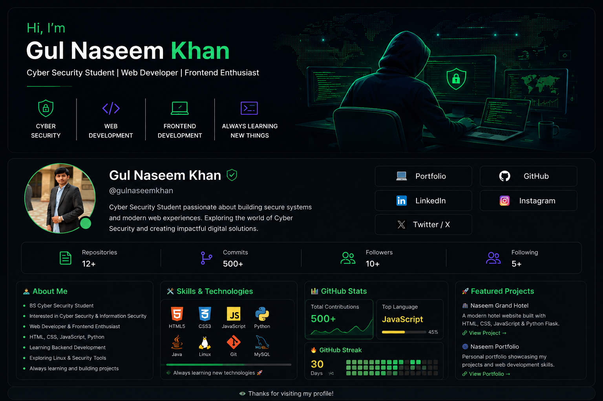

<!-- ===================== BANNER ===================== -->

  

<!-- ===================== INTRO ===================== -->

<h1 align="center">Hi, I'm Gul Naseem Khan 👋</h1>

<h3 align="center">
🔐 Cyber Security Student | 💻 Web Developer | 🎨 Frontend Enthusiast
</h3>

Passionate about Cyber Security, Web Development and building useful digital solutions.

<!-- ===================== SOCIAL LINKS ===================== -->

---

<!-- ===================== ABOUT ME ===================== -->

## 👨‍💻 About Me

- 🎓 BS Cyber Security Student
- 🔐 Interested in Cyber Security & Information Security
- 💻 Web Developer
- 🎨 Frontend Development Enthusiast
- 🌐 Working with HTML, CSS & JavaScript
- 🐍 Learning Python & Backend Development
- 🐧 Exploring Linux & Security Tools
- 🚀 Building practical projects
- 📚 Always learning new technologies

---

<!-- ===================== CURRENT WORK ===================== -->

## 🔭 Currently Working On

### 🏨 Naseem Grand Hotel

A modern hotel website project focused on creating a professional and responsive web experience.

**Technologies:**

`HTML` `CSS` `JavaScript` `Python` `Flask`

---

<!-- ===================== PORTFOLIO ===================== -->

## 🌐 My Portfolio

All of my web development projects are available on my portfolio.

---

<!-- ===================== CYBER SECURITY ===================== -->

## 🔐 Cyber Security

---

<!-- ===================== WEB DEVELOPMENT ===================== -->

## 💻 Web Development

---

<!-- ===================== LANGUAGES & TOOLS ===================== -->

## 🛠️ Languages & Tools

---

<!-- ===================== GITHUB STREAK ===================== -->

## 🔥 GitHub Streak

---

<!-- ===================== FEATURED PROJECTS ===================== -->

## 🚀 Featured Projects

### 🏨 Naseem Grand Hotel

Modern hotel website built as a web development project.

**Stack:** HTML • CSS • JavaScript • Python • Flask

<a href="https://naseemkhan.pythonanywhere.com/" target="_blank">
View Project →
</a>

---

### 🌐 Naseem Portfolio

Personal portfolio website showcasing my web development projects and skills.

<a href="https://naseemkhan.netlify.app/" target="_blank">
View Portfolio →
</a>

---

### 🤖 AI Chatbot

An AI-based chatbot project developed while exploring Python and AI technologies.

<a href="https://github.com/gulnaseemkhan/AI_chatbot" target="_blank">
View Project →
</a>

---

<!-- ===================== CONNECT ===================== -->

## 🤝 Connect With Me

---

<!-- ===================== PROFILE VIEWS ===================== -->

---

<h3 align="center">
🔐 Code • Learn • Secure • Build 🚀
</h3>

Thanks for visiting my profile! ⭐

